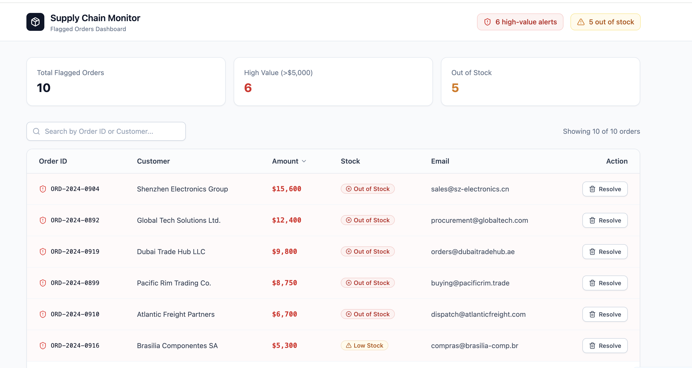
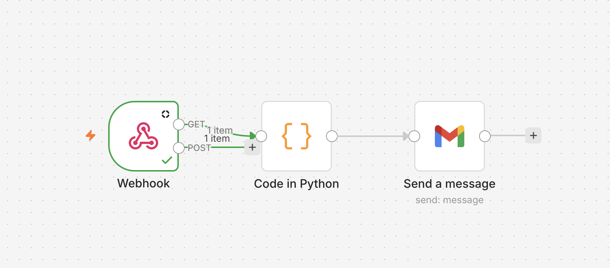

# Supply Chain Alert Agent

## 📸 System Overview

### 1. Management Dashboard (Bolt.new)
*This is the real-time interface for operations managers to review flagged anomalies.*


### 2. Workflow Orchestration (n8n)
*The backend automation logic that handles risk detection and real-time alerts.*


## 💡 Problem Statement
Wholesale order processing often involves manual, error-prone tracking. I built this agent to automate anomaly detection and streamline the decision-making process.

## 🏗️ Architecture
```mermaid
graph LR
    A[Orders.csv] --> B[Python Engine]
    B -->|PII Masking| C{Risk Engine}
    C -->|Webhook| D[n8n Automation]
    D --> E[Slack/Email Alert]
    B -->|API| F[React Dashboard]
